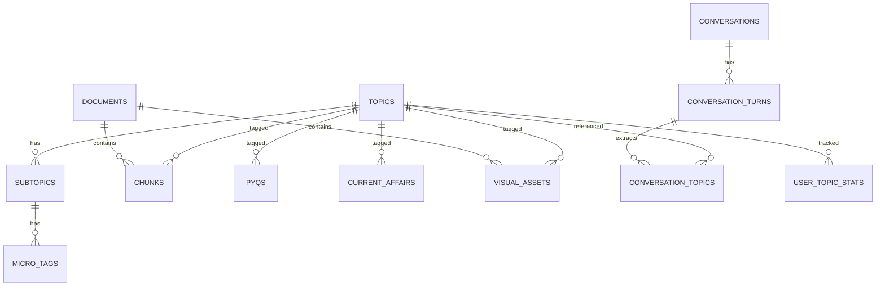

<div align="center">

# 🧠 UPSC Intelligence System

**A Multimodal, Memory-Aware AI Study Engine for UPSC Aspirants**

*Not just a chatbot — a personal UPSC intelligence engine that reads your PDFs,
remembers daily news, detects your weak areas, and helps you write better answers.*

[](https://fastapi.tiangolo.com)
[](https://www.postgresql.org)
[](https://react.dev)
[](https://www.docker.com)
[](https://openai.com)

</div>

---

## ✨ What This System Does

| Capability | What It Means for You |
|:---:|---|
| 📄 **PDF Ingestion** | Upload PYQs, NCERTs, standard books, notes — text or scanned PDFs with automatic OCR |
| 🖼️ **Visual Intelligence** | Maps, tables, diagrams extracted → AI-captioned → searchable and retrievable in answers |
| 📰 **Daily Newspaper Pipeline** | Upload today's newspaper → system filters only UPSC-relevant articles, tags to syllabus, stores with date |
| ❓ **PYQ Analytics** | Pattern detection across 2016–2025 Mains + Prelims — topic frequency, command words, trends |
| 🔗 **CA → Static Linking** | Every current affairs item is auto-connected to the static syllabus (All GS1-4 & CSAT tracked) |
| 💬 **Conversation Memory** | Tracks what you've studied, what you've skipped, and builds a study behavior profile |
| 📊 **Weakness Detection** | Anomaly detection: finds topics with high PYQ weight but low coverage in your preparation |
| 📝 **Mains Answer Writing** | Structured answer generation: intro → body (3–5 dimensions) → conclusion → diagram suggestion |
| 🗓️ **Revision Planner** | Weekly/monthly cheat sheets combining your gaps, current affairs, PYQ trends, and study history |
| 🎯 **9 Query Types** | Concept, PYQ search, trend analysis, answer writing, probable questions, maps, weakness, revision, CA link |

---

## 🏗️ System Architecture

```
┌──────────────────────── FRONTEND (React + Vite) ─────────────────────────┐
│  Dashboard │ Ask & Learn │ Upload │ Daily Briefing │ Analytics │ Revision │ Visuals  │
└────────────────────────────────────┬──────────────────────────────────────┘
                                     │ API (REST)
┌────────────────────────────────────▼──────────────────────────────────────┐
│                        BACKEND (FastAPI)                                   │
│                                                                            │
│  ┌─── Ingestion ───┐  ┌── Tagging ──┐  ┌── Retrieval ──┐  ┌── Intel ──┐ │
│  │ PDF Processor   │  │ Auto-Tagger │  │ Hybrid Search │  │ Weakness  │ │
│  │ OCR Service     │  │ Taxonomy    │  │ RAG Pipeline  │  │ Revision  │ │
│  │ Chunker         │  │ Cache       │  │ Intent        │  │ Visual    │ │
│  │ File Storage    │  │             │  │ Detector      │  │ Intel     │ │
│  │ Newspaper       │  │             │  │               │  │ PYQ       │ │
│  │ Pipeline        │  │             │  │               │  │ Ingestion │ │
│  └─────────────────┘  └─────────────┘  └───────────────┘  └───────────┘ │
│                                                                            │
│  ┌── LLM ──────────┐  ┌── Core ──────────────────────────────────────┐   │
│  │ GPT-4o Client   │  │ Config │ Database │ Rate Limiter │ Errors   │   │
│  │ Embeddings      │  └──────────────────────────────────────────────┘   │
│  │ 7 UPSC Prompts  │                                                     │
│  └─────────────────┘     Celery Worker (background OCR/tagging/embed)    │
└──────────────────────────────────┬────────────────────────────────────────┘
                                   │
        ┌──────────────────────────┼──────────────────────────┐
        ▼                          ▼                          ▼
  ┌──────────┐           ┌──────────────┐           ┌──────────────┐
  │PostgreSQL│           │   pgvector   │           │ File Storage │
  │(14 tables│           │ (embeddings  │           │ (PDFs, imgs, │
  │ 20 enums)│           │  HNSW index) │           │  newspapers) │
  └──────────┘           └──────────────┘           └──────────────┘
```

---

## 🛠️ Tech Stack

| Layer | Technology | Why |
|:---:|---|---|
| **Backend** | Python 3.11 + FastAPI | Async, fast, auto-docs, production-grade |
| **Database** | PostgreSQL 16 | Structured data, full-text search, reliable |
| **Vector Search** | pgvector (inside PostgreSQL) | Semantic search without extra infra |
| **PDF Extraction** | PyMuPDF | Text + image extraction from PDFs |
| **OCR** | OCRmyPDF + Tesseract | Makes scanned PDFs searchable |
| **LLM** | OpenAI GPT-4o | Auto-tagging, captioning, answer generation |
| **Embeddings** | text-embedding-3-large (3072d) | High-quality semantic retrieval |
| **Background Jobs** | Celery + Redis | Async OCR, tagging, and embedding |
| **Migrations** | Alembic | Schema versioning and rollback |
| **Frontend** | React 18 + Vite + Tailwind CSS | Premium dark-mode dashboard |
| **Deployment** | Docker Compose | One-command start for all 5 services |

---

## 📁 Project Structure

```
upsc_intelligence/
├── backend/
│   ├── app/
│   │   ├── main.py                            # FastAPI entry point
│   │   ├── worker.py                          # Celery background tasks
│   │   ├── api/routes/                        # 6 route files, 20+ endpoints
│   │   │   ├── upload.py                      # PDF/newspaper/JSON ingestion
│   │   │   ├── query.py                       # RAG-powered Q&A
│   │   │   ├── analytics.py                   # Weakness + PYQ trends + CA coverage
│   │   │   ├── revision.py                    # Weekly/monthly cheat sheets
│   │   │   ├── visuals.py                     # Map/diagram management
│   │   │   └── health.py                      # System health check
│   │   ├── core/                              # Config, DB, rate limiter, error handlers
│   │   ├── models/                            # 7 SQLAlchemy model files (14 tables)
│   │   │   ├── topic.py                       # Topics → Subtopics → MicroTags
│   │   │   ├── document.py                    # Documents + Chunks (with embeddings)
│   │   │   ├── pyq.py                         # PYQ questions 2016–2025
│   │   │   ├── current_affair.py              # Daily newspaper articles
│   │   │   ├── visual_asset.py                # Maps/tables/diagrams + AI captions
│   │   │   ├── conversation.py                # Chat sessions + topic extraction
│   │   │   └── user_stats.py                  # Weakness tracking + revision logs
│   │   └── services/
│   │       ├── ingestion/                     # 7 files: PDF → OCR → chunk → store
│   │       ├── tagging/                       # 3 files: auto-tag with GPT-4o
│   │       ├── retrieval/                     # 3 files: RAG + hybrid search + intent
│   │       ├── intelligence/                  # 3 files: weakness + visuals + PYQ
│   │       └── llm/                           # 3 files: GPT-4o client + 7 prompts
│   ├── migrations/                            # Alembic (14 tables, 20 enums, HNSW)
│   ├── tests/                                 # ~30 automated tests
│   ├── scripts/
│   │   ├── seed_taxonomy.py                   # Pre-seeds UPSC topic tree
│   │   └── init_db.sql                        # pgvector extension setup
│   ├── Dockerfile
│   ├── requirements.txt
│   ├── setup.sh                               # Local dev bootstrap
│   └── .env.example
├── frontend/
│   ├── src/
│   │   ├── pages/                             # 7 pages (Dashboard → Visuals)
│   │   ├── components/                        # Sidebar, Toast notification system
│   │   ├── utils/api.js                       # 25 API client functions
│   │   └── styles/globals.css                 # Design system (dark mode)
│   ├── vite.config.js
│   └── Dockerfile
├── storage/                                   # Uploaded files (Docker volume)
│   ├── pdfs/{pyqs,ncerts,books,notes,syllabus}/
│   ├── images/
│   ├── newspapers/
│   └── temp/
├── docker-compose.yml                         # One-command deployment (5 services)
├── .env.example
├── SETUP_GUIDE.md                             # Complete setup instructions
└── README.md                                  # ← You are here
```

---

## 🚀 Quick Start

### Prerequisites

- [Docker Desktop](https://www.docker.com/products/docker-desktop/) (latest)
- [OpenAI API Key](https://platform.openai.com/api-keys) (GPT-4o access)

### 1. Configure Environment

```bash
cd upsc_intelligence
cp .env.example .env
# Edit .env → add your OPENAI_API_KEY and set POSTGRES_PASSWORD
```

### 2. Start Everything

```bash
docker-compose up --build
```

This starts **5 services**: PostgreSQL + pgvector, Redis, FastAPI backend, Celery worker, React frontend.

First build takes ~5–10 minutes. Subsequent starts take ~20 seconds.

### 3. Open the Application

| Service | URL |
|---|---|
| 🖥️ **Frontend Dashboard** | http://localhost:3000 |
| 📖 **API Documentation** | http://localhost:8000/docs |
| ❤️ **Health Check** | http://localhost:8000/health |

> See [SETUP_GUIDE.md](SETUP_GUIDE.md) for detailed instructions, troubleshooting, and your first upload walkthrough.

---

## 📖 Daily Usage

### Morning Routine
1. **Upload newspaper** → Daily Briefing → drop PDF → wait 2–3 min
2. **Check dashboard** → new CA items appear automatically
3. **Ask questions** on topics you're studying today

### Example Queries (Ask & Learn)

```
Explain Indian Federalism with constitutional provisions and recent issues
```
```
What are recurring themes in GS2 Polity from 2016 to 2025?
```
```
Write a 250-word mains answer on inflation using demand-supply
```
```
List 5 probable questions on Indus Valley Civilization
```
```
Which topics am I lagging in?
```
```
Give me my weekly revision cheat sheet
```
```
Show me maps related to Western Ghats biodiversity
```

---

## 🗄️ Database Schema

**14 tables** across 7 model groups, connected through the topic taxonomy:



---

## 🧪 Running Tests

```bash
cd backend
pip install -r requirements.txt
pytest tests/ -v
```

---

## 🐳 Docker Commands

```bash
# Start all services
docker-compose up --build

# Stop (data preserved)
docker-compose down

# Stop + delete ALL data (fresh start)
docker-compose down -v

# View logs
docker-compose logs -f backend
docker-compose logs -f worker

# Re-seed taxonomy
docker-compose exec backend python scripts/seed_taxonomy.py
```

---

## 🔧 Local Development (Without Docker)

```bash
# Backend
cd backend
python -m venv venv && source venv/bin/activate  # or .\venv\Scripts\activate on Windows
pip install -r requirements.txt
cp .env.example .env  # fill in values
alembic upgrade head
python scripts/seed_taxonomy.py
uvicorn app.main:app --reload --port 8000

# Frontend
cd frontend
npm install
npm run dev  # http://localhost:3000

# Monolithic Serving (FastAPI serving React natively)
# Build your frontend first:
cd frontend && npm run build
# FastAPI will automatically detect the /dist folder and serve it at http://localhost:8000/
# Note: All endpoints are cleanly separated under the `/api/` prefix.
```

---

## 📊 Build Phases (All Complete ✅)

| Phase | Focus | Status |
|:---:|---|:---:|
| 1 | Project setup + folder structure | ✅ |
| 2 | Database schema (14 tables + pgvector + Alembic) | ✅ |
| 3 | PDF ingestion + OCR pipeline | ✅ |
| 4 | Auto-tagging + embeddings + newspaper pipeline | ✅ |
| 5 | RAG + hybrid search + all query endpoints | ✅ |
| 6 | Visual intelligence + weakness detection + PYQ ingestion | ✅ |
| 7 | React frontend (7 pages, premium dark theme) | ✅ |
| 8 | Docker + deployment + rate limiting + error handling + tests | ✅ |

---

## 🔐 Security

- **Rate limiting** on all endpoints (slowapi)
- **Structured error responses** — no stack traces leaked to clients
- **Environment variables** for all secrets (`.env` in `.gitignore`)
- **Input validation** via Pydantic models
- **CORS** configured for frontend origin

---

## 📋 System Requirements

| Component | Minimum | Recommended |
|---|---|---|
| RAM | 4 GB | 8 GB |
| Storage | 10 GB free | 50 GB (for full document library) |
| CPU | 2 cores | 4 cores |
| Internet | Required (OpenAI API calls) | Stable broadband |

---

## 📄 License

Private — built for personal UPSC preparation.

---

<div align="center">

*"Not just a chatbot — a personal UPSC intelligence engine  
that reads your PDFs, remembers daily news, detects your weak areas,  
and helps you write better answers."*

**Built with ❤️ for UPSC aspirants**

</div>
